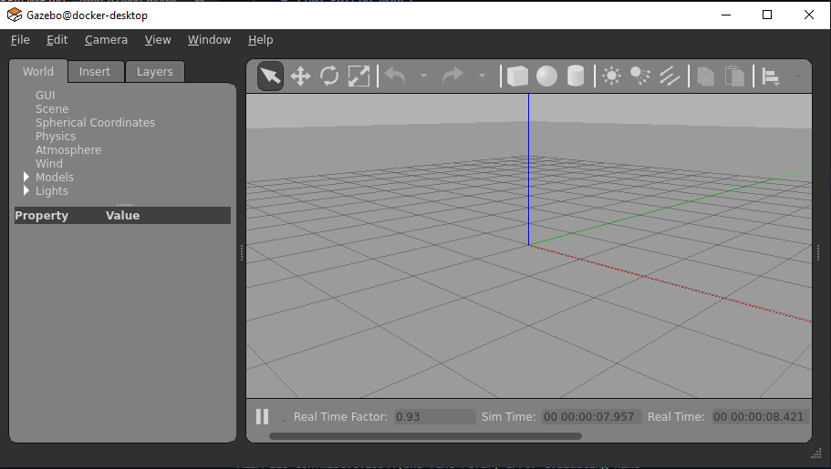
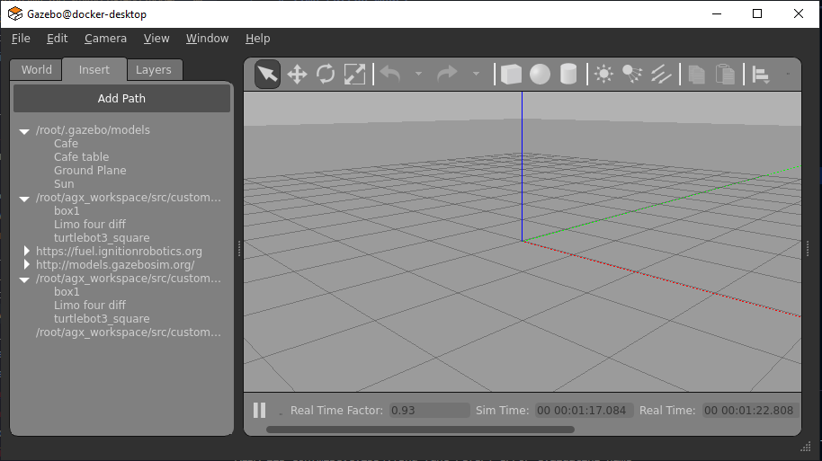
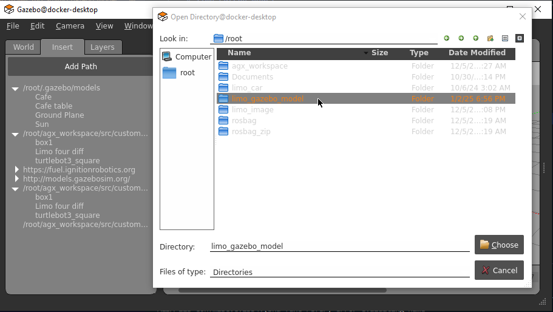
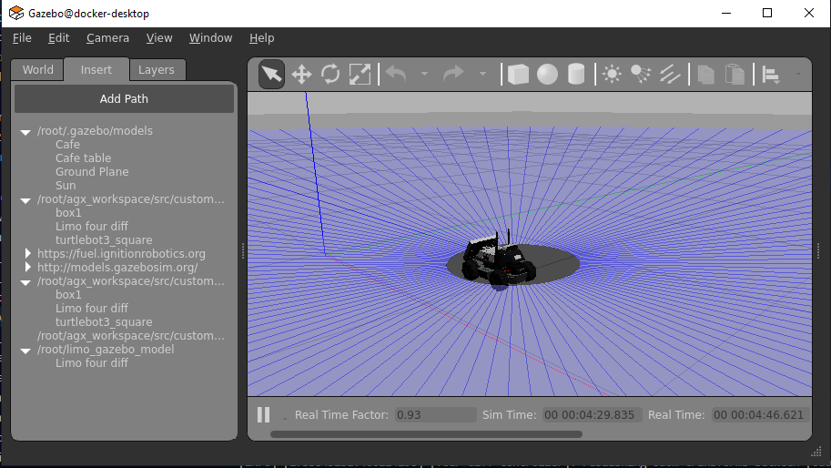

# limo_gazebo_model
The sdf file for the Agilex Limo Robot. Original Source: https://github.com/agilexrobotics/limo_ros2/tree/master

# Steps to run the model
## Step 1: Clone the repo
Run `git clone https://github.com/Saad135/limo_gazebo_model.git`

## Step 2: Start Gazebo
Assuming gazebo is installed, Run `gazebo`. The picture below shows the gazebo UI.

## Step 3: Add model path
Click on the insert tab from the panel on the left hand side and click add path.

After clicking the add path button, Select the download repo as shown in the picture below.

## Step 4: Load model
Select the model from the left pane and click once on the map. The cursor turns to a loading icon. Wait for the model to load (Might take a few seconds, since the mesh files are big).

